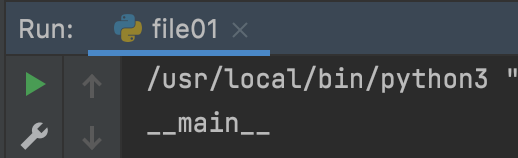
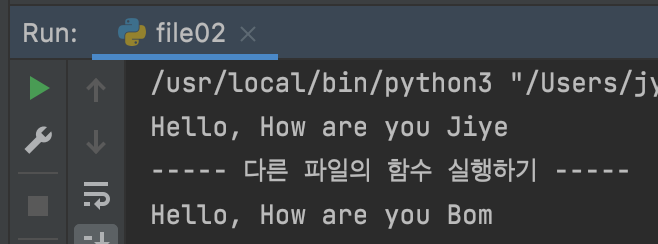
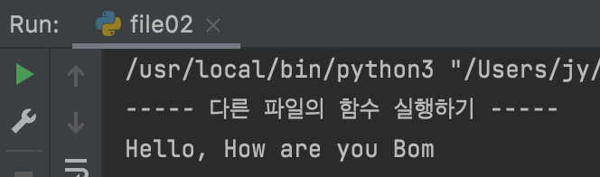

단순하게 보면 두 개의 항목이 일치하는지 확인하는 조건문이다.

즉, 일치하면 실행하고 일치하지 않으면 else 구문에 기재된 code를 실행하게 된다.

모든 python file은 자체 파일에 대한 `__name__`이 `__main__`으로 자동 할당된다.

예시로 file01.py 파일을 만든 뒤 `print(__name__)` 하게 되면 다음과 같이 출력한다.



# 왜 사용해야 하는가?

실행 중인 파일의 모듈의 이름 (__name__) 은 “__main__”이 된다. 즉 해당 파일이 import 되어 사용되는지 여부 또는 프로그램의 시작점일 때만 특정 코드를 실행하기 위해 사용된다. 

1. 두 개의 테스트 파일을 생성
    - file01.py
    
    ```python
    def test01(test_text):
        return print("Hello, How are you", test_text)
    
    test01("Jiye")
    ```
    
    - file02.py
    
    ```python
    import file01
    
    print("----- 다른 파일의 함수 실행하기 -----")
    file01.test01("Bom")
    ```
    
2. file02.py 실행
    - 의도하지 않은 `Hello, How are ou Jiye` 가 출력된 것을 확인 가능하다.
    
    
    
3. `if __name__ == "__main __":` 추가 후 file.02 실행
    - file01.py
    
    ```python
    def test01(test_text):
        return print("Hello, How are you", test_text)
    
    # 해당 파일을 직접 실행할때에만 실행되게 추가 
    if __name__ == "__main__":
        test01("Jiye")
    ```
    
    - file02.py
    
    ```python
    import file01
    
    print("----- 다른 파일의 함수 실행하기 -----")
    file01.test01("Bom")
    ```
    
    - 결과
        - 이제 `Hello, How are ou Jiye` 가 출력되지 않는 것을 확인할 수 있다.

          
            
        - `__main__` 은 file02이기 때문에 file01의  test01("Jiye") 은 실행되지 않은 것을 확인할 수 있다.
            
            ```python
            # file02.py
            print(__name__)
            print(file01.__name__)
            
            #결과
            __main__
            file01
            ```
            

# __name__ 은 무엇인가?

<aside>
💡 dir()
- 네임 스페이스에 등록되어 있는 모든 이름들을 리스트로 반환해주는 파이썬의 내장 함수 
- 어떤 객체를 인자로 넣어주면 해당 객체가 어떤 변수와 메소드를 가지고 있는지 나열

</aside>

다음과 같이 실행하게 되면 파이썬에 내장되어 있는 속성을 확인할 수 있다. 자기 자신과 `__name__`도 포함되어 있다.

- __가 붙어 있는 것들은 python 인터프리터를 실행될 때 자동으로 등록된 특수한 목적이 있는 속성들이다.

```python
# test01.py
print(dir())

#결과
['__annotations__', '__builtins__', '__cached__', '__doc__', '__file__', '__loader__', '__name__', '__package__', '__spec__', 'test01']
```

`print(__name__)` 실행하면 다음과 같이 출력하게 된다. 즉 해당 파일에서 파이썬을 실행하여 name은 main이라는 의미이다.

```python
# test01.py
print(__name__)

#결과
__main__
```

**이처럼 `__name__`은 현재 프로그램이 실행되고 있는 모듈의 이름이 저장되어 있다.**